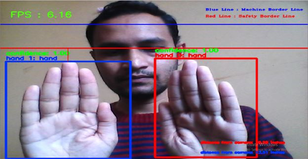
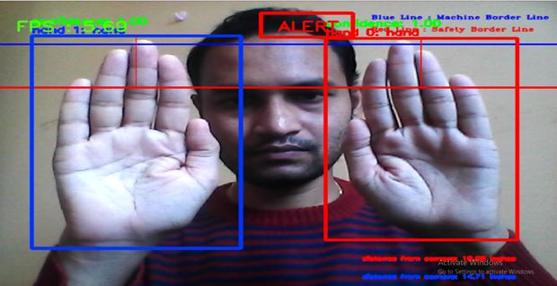

<h2>Hand Detection Shredder Machine Project</h2>

<h2>About this Project:</h2>

<h2>This project is contributed to one of the cement factory company, which is located in Spain.</h2>

<h3>Business Problem:</h3>

Implementing a hand detection model for a shredder machine in a factory involves combining computer vision and deep learning techniques to ensure the safety of workers and prevent accidents. By implementing this project a careful balance between accuracy, real-time processing, and safety considerations. Regular monitoring and updates are essential to maintain the effectiveness of the system over time.

  
  
  
  
<h3>Business Solution:</h3> 

With the help of DeepLearning using the Object detection model, we have developed a model to find hand detection and display alert messages to the worker.  
In this project, First, we will find the hand detection and then we will create a safety borderline. 
For suppose, if a person's hand crosses the safety borderline, he/she will get an alert message along with an alarming sound. so that it's alert the worker, and also stops the process until the person removes his hand from the safety border line.

  
  
  
  
  
  
  
