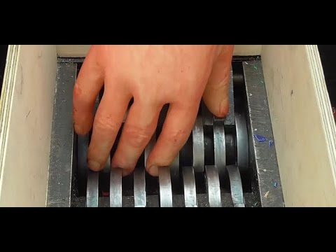
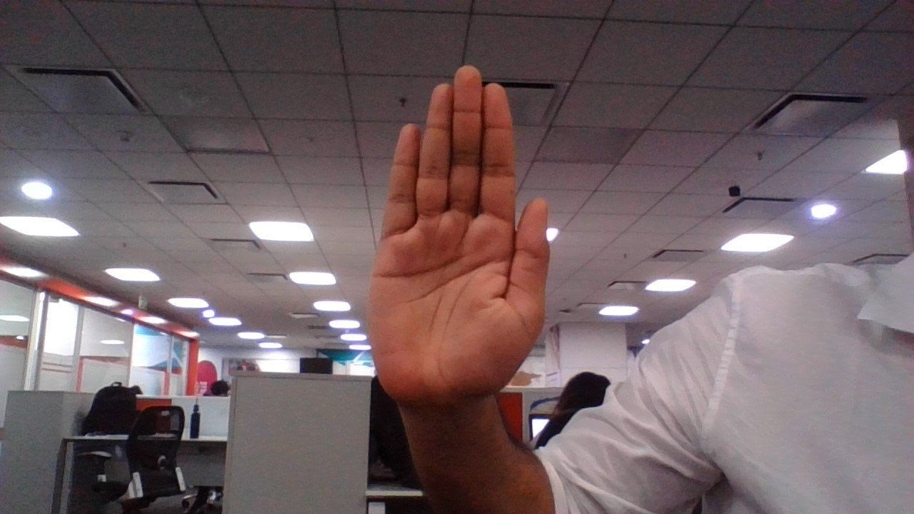
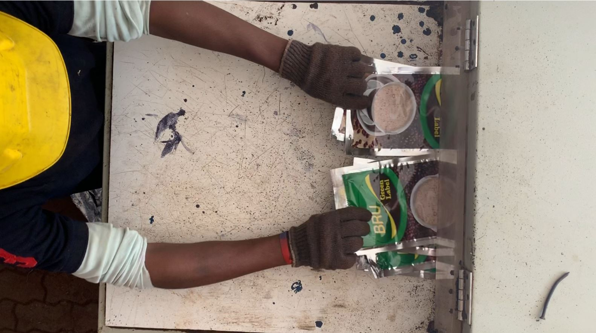

<h2>Hand Detection Shredder Machine Project</h2>

<h2>About this Project:</h2>

<h2>This project is contributed to one of the cement factory company, which is located in Spain.</h2>

<h3>Business Problem:</h3>

In general in the cement factory industry, usually workers are working with Shredder Machine to reproduce the new product from the scrap. 
but sometimes there might be a chances that to unexpectedly or with the worker minimum attention workers are losing their hands or got injured to their hands.

  
  
  
  
<h3>Business Solution:</h3> 

With the help of DeepLearning using the Object detection model we have developed a model to find hand detection and make an alert to the worker.  
In this project, First it will find the hand detection and then we created a threshold line. 
For suppose, if a person hand cross to threshold line, you will get an alarming sound to alert the worker, and also it stops the process until that the person has to
remove his hand from the threshold line.

  
  
  
  
  
  
  
